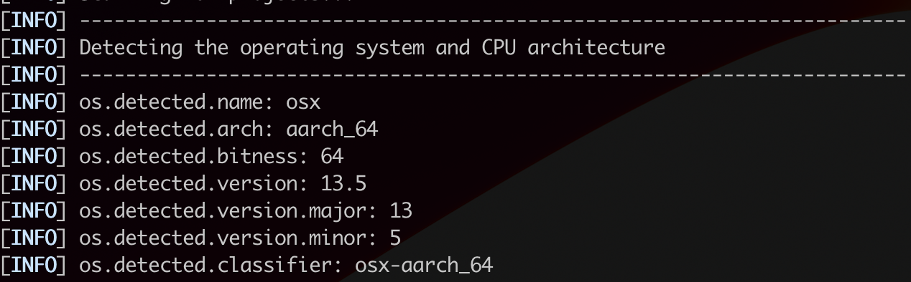
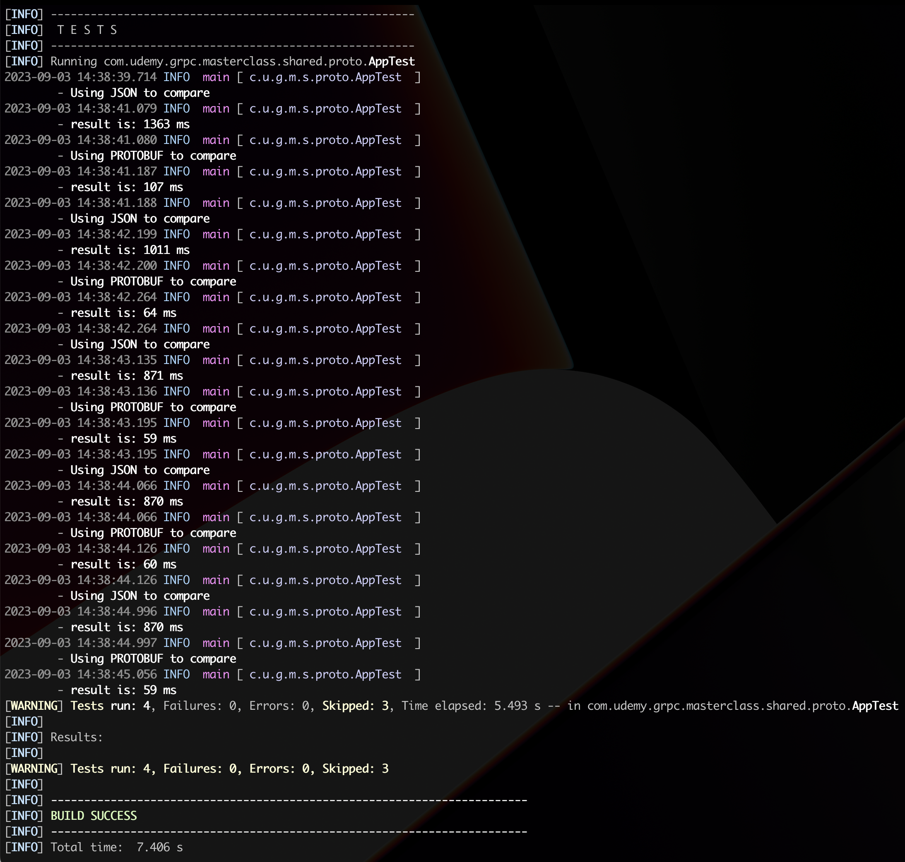
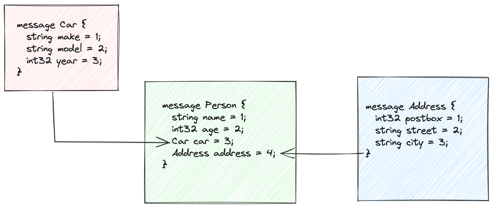

= gRPC Masterclass w/ Spring Boot & Apache Camel

== Links

- https://camel.apache.org/components/4.0.x/grpc-component.html[Camel gRPC]
- https://github.com/vinsguru/grpc-java-course[GitRepo Course]
- https://www.xolstice.org/protobuf-maven-plugin/[Maven Protobuff plugins]

== Concepts

* Big apps are spread out in micro applications, and this comes with some challenges, in most part of the time all the communication is in Json with HTTP 1.1 between the MSA, using sync communication, http protocol is stateless with some limitations

* Stubby is Google's RPC framework for their inter services communication, stubby is neutral from language and platform, but it is tightly coupled with their infrastructure

* gRPC was developed by Google and inspired in Stubby, released in 2016 with huge adoption among Companies such as Netflix and Microsoft, gRPC is for intercommunication between Microservices communication

* HTTP was released in 1997, it uses TCP in a 3-way handshake process with a significant amount of time waste to establish the connection

.HTTP1 vs HTTP2
image::thumb/http1-vs-http2-multiplexing.png[]

* Some Benefits from gRPC

. HTTP/2 by default
. Binary, Multiplexing, and flow-control
. Non-blocking, streaming bindings
. Protobuf w/ strict typing DTO, service definitions auto-generated bindings for multiple languages,
. Great for mobile apps
. Very Fast/Optimized for inter-services communication
. Platform and Language neutral
. Se(De)rializing structured data

* Some Guidelines

. 1-15 for frequently used fields
. Do not reorder the fields once it is in use
. Adding new fields will not break old proto
. Removing fields will not break old proto
.. Use reserved .Changing Type
.. int32 -> int64 is OK
.. int64 -> int32 be a problem
. Renaming is OK, but be cautious
. Always keep the protos as separate maven-multi-module and add them dependency in other modules

. Project Structure

.Gemfile.lock
----
+- grpc-masterclass
+-+- camel-projs
+-+-+- say-hello
+-+-+- pom.xml
+-+- pom.xml
+-+- springb-projs
+-+-+- say-hello
+-+-+- pom.xml
+-+- pom.xml
+-+- shared-proto
+-+- pom.xml
+- README.adoc
+- pom.xml
----

.Maven Structure Recommendations
[source,xml]
----

<dependencies>
	<dependency>
		<groupId>io.grpc</groupId>
		<artifactId>grpc-protobuf</artifactId>
		<version>x.x.x</version>
	</dependency>
	<dependency>
		<!-- necessary for Java 9+ -->
		<groupId>org.apache.tomcat</groupId>
		<artifactId>annotations-api</artifactId>
		<version>x.x.x</version>
		<scope>provided</scope>
	</dependency>
</dependencies>
----

[source,xml]
----

<build>
	<extensions>
		<extension>
			<groupId>kr.motd.maven</groupId>
			<artifactId>os-maven-plugin</artifactId>
			<version>1.7.1</version>
		</extension>
	</extensions>
	<plugins>
		<plugin>
			<groupId>org.apache.maven.plugins</groupId>
			<artifactId>maven-compiler-plugin</artifactId>
			<configuration>
				<source>17</source>
				<target>17</target>
			</configuration>
		</plugin>
		<plugin>
			<groupId>org.xolstice.maven.plugins</groupId>
			<artifactId>protobuf-maven-plugin</artifactId>
			<version>0.6.1</version>
			<configuration>
				<protocArtifact>
                        com.google.protobuf:protoc:3.21.7:exe:${os.detected.classifier}
                    </protocArtifact>
				<pluginId>grpc-java</pluginId>
				<pluginArtifact>
                        io.grpc:protoc-gen-grpc-java:1.54.0:exe:${os.detected.classifier}
                    </pluginArtifact>
				<protoSourceRoot>
                        ${basedir}/src/main/proto/
                    </protoSourceRoot>
			</configuration>
			<executions>
				<execution>
					<goals>
						<goal>compile</goal>
						<goal>compile-custom</goal>
					</goals>
				</execution>
			</executions>
		</plugin>
	</plugins>
</build>

----

.Protobuf Maven Plugin Sample

.Performance Se(De)rialization Comparison Json vs Protobuf

.Types Equivalence
|===
|Java Types |Protobuf Types

|int
|int32

|long
|int64

|float
|float

|double
|double

|boolean
|bool

|String
|string

|byte[]
|bytes

|Collection/List
|repeated

|Map
|map

|===

.Protobuf Complex Pojo Composition

.Types Equivalence
|===
|Proto Type |Default

|int32/any number type
|0

|bool
|false

|string
|empty string

|enum
|first value

|repeated
|empty list

|map
|wrapper / empty map
|===

== Proto OneOf

* Concepts to specific how we can implement just one of message

[source,protobuf]
----
message MyCard {
  oneof mode {
    MessageOne one = 1;
    MessageTwo two = 2;
  }
}
----

[source,protobuf]
----
message Person {
  // Each field is assigned with unique Number
  // 1-15 - 1 byte frequently used fields
  // 16-2047 - 2 bytes not frequently used fields
  string name = 1;
}
----

